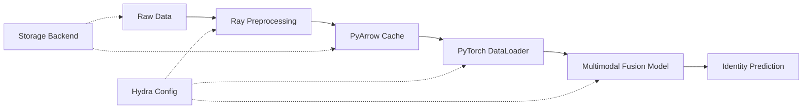

# Multimodal Biometric Recognition System

A scalable, production-quality ML infrastructure for multimodal biometric recognition using iris and fingerprint data. Built with clean Python engineering, config-driven architecture, and MLOps best practices.

## Architecture Overview



**Key Design Decisions** (see [docs/adr/](docs/adr/) for full rationale):
- **Hydra** for hierarchical, config-driven pipeline orchestration
- **PyArrow/Parquet** for cached data loading (3-5x speedup over raw image decode)
- **Ray** for parallel preprocessing (scales from local to Kubernetes clusters)
- **Strategy Pattern** for swappable fusion strategies (concatenation / attention)
- **Storage Abstraction** for transparent local ↔ Azure Blob migration

## Project Structure

```
├── configs/              # Hydra YAML configurations
│   ├── config.yaml       # Root config (composes sub-configs)
│   ├── data/             # Data loading & preprocessing configs
│   ├── model/            # Model architecture configs
│   └── training/         # Training hyperparameter configs
├── src/biometric/        # Main package
│   ├── data/             # Dataset, DataLoader, transforms, Arrow cache
│   ├── models/           # Encoders (iris, fingerprint) + fusion network
│   ├── training/         # Trainer, callbacks, metrics
│   ├── inference/        # Prediction pipeline
│   ├── preprocessing/    # Ray-based parallel preprocessing
│   ├── storage/          # Storage backend abstraction (local / Azure)
│   └── utils/            # Logging, reproducibility, profiling
├── tests/                # Comprehensive test suite
├── benchmarks/           # Data loading performance benchmarks
├── scripts/              # Entry points (download, preprocess, train)
├── docs/                 # Architecture docs & ADRs
│   ├── architecture.md
│   ├── scalability-analysis.md
│   └── adr/              # Architecture Decision Records
└── .github/workflows/    # CI pipeline (lint, test, smoke test)
```

## Quick Start

### 1. Installation

```bash
# Clone and install in development mode
git clone <repo-url>
cd multimodal-biometric-mlops

# Create virtual environment
python -m venv .venv

# Activate virtual environment
source .venv/bin/activate

# Install dependencies
pip install -e ".[dev]"

# Install pre-commit hooks
pre-commit install

# Install kaggle CLI
pip install kaggle
```

### 2. Download Dataset

```bash
# Requires Kaggle CLI configured (pip install kaggle)
python scripts/download_data.py --output-dir data/raw
```

Dataset: [Multimodal Iris & Fingerprint Biometric Data](https://www.kaggle.com/datasets/ninadmehendale/multimodal-iris-fingerprint-biometric-data) — 45 subjects, iris + fingerprint images.

### 3. Preprocess Data

```bash
# Parallel preprocessing with Ray + build PyArrow cache
python scripts/preprocess.py

# Sequential fallback (no Ray)
python scripts/preprocess.py --no-ray
```

### 4. Train

```bash
# Default training
python scripts/train.py

# Quick debug run (3 epochs, no checkpointing)
python scripts/train.py training=quick

# Override parameters via CLI
python scripts/train.py training.epochs=20 data.dataloader.batch_size=32

# Try attention fusion
python scripts/train.py model.fusion.strategy=attention
```

### 5. Run Benchmarks

```bash
python benchmarks/benchmark_dataloader.py --data-dir data/processed
```

## Development

```bash
make help          # Show all available commands
make lint          # Run ruff linter
make format        # Auto-format code
make typecheck     # Run mypy type checker
make test          # Run unit tests
make test-cov      # Run tests with coverage report
make all           # Run lint + typecheck + test
```

## Design Highlights

### Scalable Architecture
- **Storage abstraction** (`StorageBackend` ABC) enables zero-code-change migration from local filesystem to Azure Blob Storage
- **Ray preprocessing** scales from 4 local cores to a Kubernetes Ray cluster
- **Sharded Parquet cache** supports delta updates — new data is appended without reprocessing existing shards
- See [Scalability Analysis](docs/scalability-analysis.md) for detailed 10x/100x/1000x breakdown

### Production-Quality Python
- Type hints on all function signatures
- Abstract base classes with clear contracts
- Google-style docstrings on all public APIs
- `pyproject.toml` for modern dependency management
- `ruff` for linting + formatting, `mypy` for type checking

### Reproducibility
- Deterministic seeding across Python, NumPy, PyTorch, and CUDA
- Full config logging via Hydra (every run saves its resolved config)
- Checkpoint saves include epoch number, metrics, and model state

### CI/CD Pipeline
- **Linting**: ruff check + format verification
- **Type checking**: mypy strict mode
- **Testing**: pytest across Python 3.10, 3.11, 3.12
- **Smoke test**: End-to-end model forward pass validation

## Technology Stack

| Category | Technology | Rationale |
|---|---|---|
| ML Framework | PyTorch | Industry standard for research + production |
| Configuration | Hydra | Hierarchical configs, CLI overrides, experiment logging |
| Data Caching | PyArrow/Parquet | Columnar, compressed, zero-copy reads |
| Parallel Processing | Ray | Scales local → cluster, shared memory |
| CI/CD | GitHub Actions | Native to GitHub, matrix testing |
| Linting | ruff | Fast, comprehensive, replaces flake8+isort+black |
| Type Checking | mypy | Static type verification |
| Testing | pytest | Fixtures, parametrize, coverage |
| Containerization | Docker | Multi-stage build for reproducible environments |

## Documentation

- [System Architecture](docs/architecture.md) — Full architecture diagram and design patterns
- [Scalability Analysis](docs/scalability-analysis.md) — Bottleneck analysis at 10x/100x/1000x scale
- **Architecture Decision Records**:
  - [ADR-001: Hydra Configuration](docs/adr/001-hydra-config.md)
  - [ADR-002: PyArrow Caching](docs/adr/002-pyarrow-caching.md)
  - [ADR-003: Ray Preprocessing](docs/adr/003-ray-preprocessing.md)
  - [ADR-004: Fusion Strategy](docs/adr/004-fusion-strategy.md)

## License

MIT
