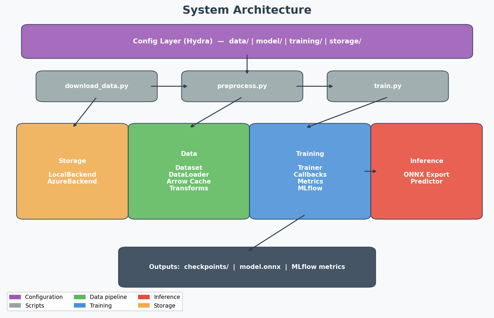
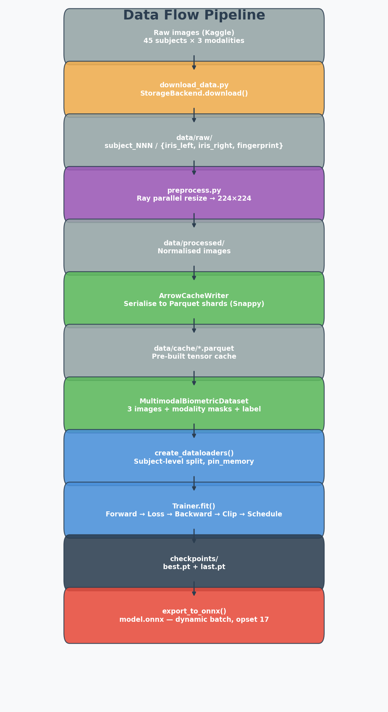
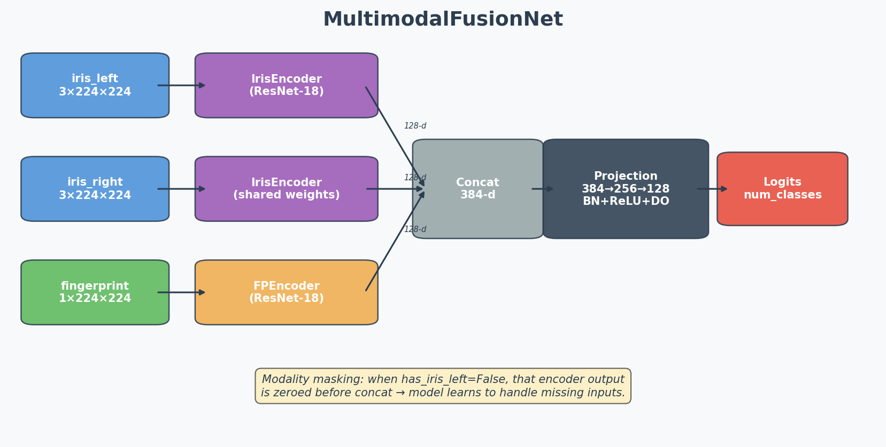
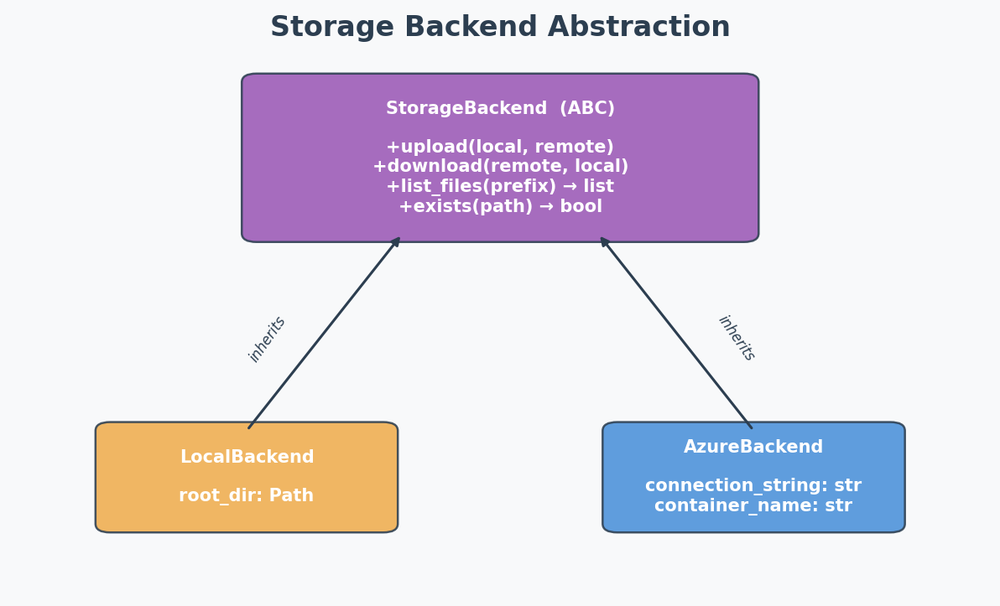

# System Architecture

The pipeline takes raw iris + fingerprint images, preprocesses them (optionally in parallel with Ray), trains a late-fusion model, and exports to ONNX. Everything is config-driven via Hydra — you shouldn't need to touch Python to change batch size, swap storage backends, or tweak the LR schedule.

## System overview




I split the code into four main layers. The config layer sits on top — Hydra composes the YAML files and passes a single `DictConfig` into whichever script you run. The scripts are thin wrappers; all the real logic lives in `src/biometric/`.

## Data flow

This is probably the most useful diagram — it shows every step from raw data to deployable artifact.



A few notes on choices here:

- **Subject-level splits** — all images from one person go into the same split. This matters for biometrics because otherwise you'd leak identity info across train/test.
- **Arrow cache** — the first epoch pays the cost of building Parquet shards. After that, subsequent epochs skip all transform work and just deserialise tensors. On our dataset the speedup is ~5x; at larger scale it'd be bigger.
- **Checkpoints save everything** — not just model weights, but optimizer momentum, scheduler state, and the AMP GradScaler. So `resume_from_checkpoint` gives you a bit-exact continuation.

## Model architecture

The model is a simple late-fusion network. Nothing fancy — the assignment said model quality doesn't matter, so I kept it straightforward and focused on the infrastructure around it.




Iris left and right share encoder weights — they're the same modality, just different eyes. Fingerprint gets its own encoder since it's grayscale and structurally different.

**Modality masking:** each sample carries boolean flags (`has_iris_left`, `has_iris_right`, `has_fingerprint`). When a flag is False, that encoder's output is zeroed before concat. This way the fusion head learns to work even when some modalities are missing at inference time.

## Storage abstraction



The factory in `storage/factory.py` reads the Hydra config key and returns the right implementation. Switching from local dev to Azure is literally `storage=azure` on the CLI. I considered using `fsspec` for this but we only need four operations — writing our own ABC was 18 lines of code and zero extra dependencies.

## Config composition

Hydra's `defaults` list composes multiple YAML files into one config:

```yaml
# config.yaml
defaults:
  - data: default           # → configs/data/default.yaml
  - model: fusion_net       # → configs/model/fusion_net.yaml
  - training: default       # → configs/training/default.yaml
  - storage: local          # → configs/storage/local.yaml
  - _self_
```

CLI overrides happen last: `python train.py training.epochs=50 data.dataloader.batch_size=64`. You can also do multirun sweeps: `python train.py -m training.learning_rate=0.001,0.01`. Hydra handles the output directory per run and snapshots the full merged config for reproducibility.

## Callback system

The trainer runs callbacks at the end of each epoch. Keeping this as a simple list (not an event bus or signals framework) was deliberate — there are only two callbacks right now and I didn't want to over-engineer it.

```python
# pseudocode — actual implementation in training/trainer.py
for epoch in range(start_epoch, max_epochs):
    train_metrics = train_one_epoch(train_loader)
    val_metrics   = validate(val_loader)

    for cb in callbacks:
        cb.on_epoch_end(epoch, {**train_metrics, **val_metrics}, model)
        if cb.should_stop:
            break
```

- `ModelCheckpoint` — saves when `val_loss` improves (or always saves `last` if configured)
- `EarlyStopping` — sets `should_stop = True` after N epochs without improvement

Adding a new callback (e.g. LR logging, weight histograms) means implementing one method. No registration, no decorators.

## Design principles

These are the rules I tried to follow throughout the codebase:

1. **Each module does one thing.** The Trainer doesn't know about data format. The Dataset doesn't know about training. This makes testing much easier — you can unit-test each piece with mocks.

2. **Config over code.** If you're changing a hyperparameter, you shouldn't be editing Python. This also means every experiment is reproducible just by saving the Hydra config snapshot.

3. **Optional dependencies degrade gracefully.** MLflow not installed? Tracking calls become no-ops. Ray not available? Preprocessing falls back to sequential. Azure SDK missing? Use local storage. The core pipeline runs with just PyTorch.

4. **Checkpoints are complete.** Saving only model weights is a common mistake — you can't properly resume training without optimizer state, scheduler position, and GradScaler state. Ours include all of that.

5. **Production path is clear.** The ONNX export uses dynamic batch dims so the same file works for real-time (batch=1) and batch inference. The Docker image is multi-stage, non-root, with a health check. CI runs security scans.
