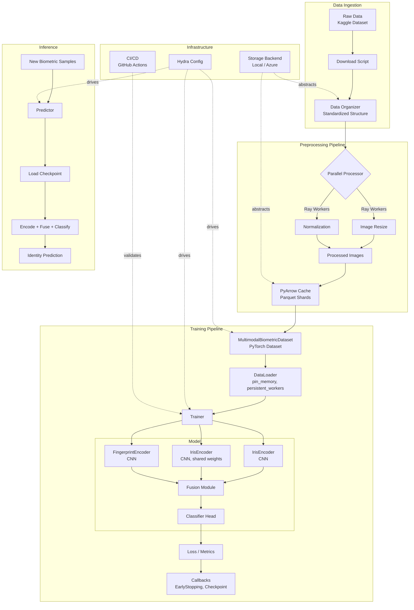

# System Architecture

## Overview

This document describes the architecture of the Multimodal Biometric Recognition System — a scalable, production-quality ML infrastructure designed for multimodal (iris + fingerprint) biometric identification.

## Architecture Diagram



## Design Patterns

### 1. Registry Pattern
- **Where**: `src/biometric/data/registry.py`
- **Why**: Enables config-driven instantiation of datasets, transforms, and models without hard-coding class references. New components are registered via decorators and looked up by string keys from Hydra configs.
- **Benefit**: Adding a new dataset or model requires zero changes to existing code.

### 2. Strategy Pattern
- **Where**: `src/biometric/models/fusion.py` (fusion strategies), `src/biometric/storage/` (storage backends)
- **Why**: Allows swapping between concatenation and attention-based fusion (or local vs Azure storage) via configuration alone.
- **Benefit**: Experimentation with different fusion approaches requires only a config change.

### 3. Factory Pattern
- **Where**: `src/biometric/storage/factory.py`, model instantiation in `scripts/train.py`
- **Why**: Centralizes object creation logic, decoupling consumers from concrete implementations.

### 4. Template Method Pattern
- **Where**: `src/biometric/training/trainer.py`
- **Why**: The training loop defines the overall algorithm (`fit` → `_train_epoch` → `_validate_epoch`), while behavior customization happens through callbacks and configuration.

### 5. Observer Pattern
- **Where**: `src/biometric/training/callbacks.py`
- **Why**: Callbacks (EarlyStopping, ModelCheckpoint) observe training events without the Trainer knowing their specifics. New callbacks can be added without modifying the Trainer.

## Data Flow

1. **Ingestion**: Raw Kaggle data → organized per-subject directory structure
2. **Preprocessing**: Ray-parallelized image resizing → PyArrow cache (Parquet shards)
3. **Loading**: PyTorch Dataset reads from cache → DataLoader with optimized workers
4. **Training**: Modality encoders → Fusion → Classifier → Loss → Backprop
5. **Inference**: Checkpoint loading → Encode → Fuse → Predict

## Configuration Architecture

All behavior is driven by Hydra YAML configs:

```
configs/
├── config.yaml          # Root: composes all sub-configs
├── data/
│   ├── default.yaml     # Standard data loading settings
│   └── performance.yaml # Optimized for benchmarking
├── model/
│   ├── fusion_net.yaml  # Full multimodal model
│   └── simple_cnn.yaml  # Lightweight variant
└── training/
    ├── default.yaml     # Full training
    └── quick.yaml       # Debug/smoke test
```

Override any parameter from CLI: `python scripts/train.py training.epochs=10 data.dataloader.batch_size=32`

## Storage Abstraction

```
StorageBackend (ABC)
├── LocalStorageBackend    ← Development (implemented)
└── AzureBlobStorageBackend ← Production (stub, shows design intent)
```

The storage abstraction ensures zero code changes when moving from local development to Azure-based training infrastructure. All data access flows through the `StorageBackend` interface.
