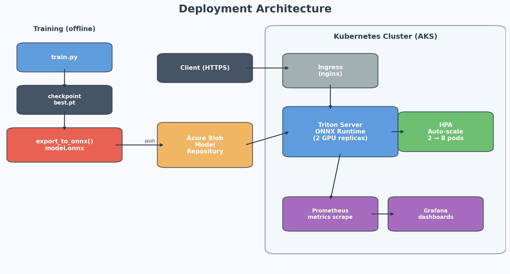

# Deployment

How to get from a trained checkpoint to a running inference endpoint. I'll cover two paths: the "proper" way (Triton on Kubernetes) and a quick-and-dirty FastAPI option for prototyping.

## The big picture



The idea is simple: train offline, export to ONNX, push the artifact to blob storage, and Triton picks it up. Kubernetes handles scaling, health checks, and rolling updates. Prometheus + Grafana give us visibility into latency and throughput.

## Exporting the model

```bash
python -c "
from biometric.models.fusion import MultimodalFusionNet
from biometric.models.export import export_to_onnx
import torch

model = MultimodalFusionNet(num_classes=45)
ckpt = torch.load('checkpoints/checkpoint_best.pt', map_location='cpu', weights_only=False)
model.load_state_dict(ckpt['model_state_dict'])

export_to_onnx(model, 'model.onnx', opset_version=17)
"
```

The export uses dynamic batch axes, so the same `.onnx` file works for single-sample real-time inference and batch processing. I went with opset 17 since that's the sweet spot for broad runtime support (ORT, TensorRT, OpenVINO all handle it).

## Triton setup

### Model repository

Triton expects a specific directory layout. Versioning is just numbered folders — drop a new `model.onnx` in `3/` and Triton hot-loads it.

```
model_repository/
└── biometric_fusion/
    ├── config.pbtxt
    ├── 1/
    │   └── model.onnx
    └── 2/
        └── model.onnx      ← latest
```

### config.pbtxt

```protobuf
name: "biometric_fusion"
platform: "onnxruntime_onnx"
max_batch_size: 32

input [
  { name: "iris_left"    data_type: TYPE_FP32 dims: [ 3, 224, 224 ] },
  { name: "iris_right"   data_type: TYPE_FP32 dims: [ 3, 224, 224 ] },
  { name: "fingerprint"  data_type: TYPE_FP32 dims: [ 1, 224, 224 ] }
]

output [
  { name: "logits" data_type: TYPE_FP32 dims: [ 45 ] }
]

# Triton will batch incoming requests automatically.
# If a request arrives within 100μs of another, they get batched together.
# This gives ~3x throughput vs handling them one at a time.
dynamic_batching {
  preferred_batch_size: [ 8, 16 ]
  max_queue_delay_microseconds: 100
}

instance_group [
  { count: 2  kind: KIND_GPU }
]
```

### Running locally

```bash
docker run --gpus all --rm \
  -p 8000:8000 -p 8001:8001 -p 8002:8002 \
  -v $(pwd)/model_repository:/models \
  nvcr.io/nvidia/tritonserver:24.01-py3 \
  tritonserver --model-repository=/models
```

Port 8000 is HTTP, 8001 is gRPC (faster for production clients), 8002 is the Prometheus metrics endpoint.

### Client code

```python
import tritonclient.http as httpclient
import numpy as np

client = httpclient.InferenceServerClient("localhost:8000")

iris_left = np.random.randn(1, 3, 224, 224).astype(np.float32)
iris_right = np.random.randn(1, 3, 224, 224).astype(np.float32)
fingerprint = np.random.randn(1, 1, 224, 224).astype(np.float32)

inputs = [
    httpclient.InferInput("iris_left", iris_left.shape, "FP32"),
    httpclient.InferInput("iris_right", iris_right.shape, "FP32"),
    httpclient.InferInput("fingerprint", fingerprint.shape, "FP32"),
]
inputs[0].set_data_from_numpy(iris_left)
inputs[1].set_data_from_numpy(iris_right)
inputs[2].set_data_from_numpy(fingerprint)

result = client.infer("biometric_fusion", inputs)
logits = result.as_numpy("logits")
predicted_class = int(np.argmax(logits, axis=1)[0])
```

## Kubernetes manifests

These are for AKS but would work on any K8s cluster with GPU nodes. I kept them minimal on purpose — in practice you'd also want network policies, pod disruption budgets, etc.

### Deployment + Service

```yaml
# k8s/deployment.yaml
apiVersion: apps/v1
kind: Deployment
metadata:
  name: biometric-inference
spec:
  replicas: 2
  selector:
    matchLabels:
      app: biometric-inference
  template:
    metadata:
      labels:
        app: biometric-inference
    spec:
      containers:
        - name: triton
          image: nvcr.io/nvidia/tritonserver:24.01-py3
          args:
            - tritonserver
            - --model-repository=s3://biometric-models/repository
          ports:
            - containerPort: 8000
            - containerPort: 8001
            - containerPort: 8002   # metrics
          resources:
            limits:
              nvidia.com/gpu: 1
              memory: "8Gi"
            requests:
              memory: "4Gi"
          livenessProbe:
            httpGet:
              path: /v2/health/live
              port: 8000
            initialDelaySeconds: 30
          readinessProbe:
            httpGet:
              path: /v2/health/ready
              port: 8000
            initialDelaySeconds: 30
---
apiVersion: v1
kind: Service
metadata:
  name: biometric-inference
spec:
  selector:
    app: biometric-inference
  ports:
    - name: http
      port: 8000
      targetPort: 8000
    - name: grpc
      port: 8001
      targetPort: 8001
    - name: metrics
      port: 8002
      targetPort: 8002
```

### Autoscaling

Scaling on Triton's own metrics via the Prometheus adapter. The HPA watches `nv_inference_request_success` — once a pod averages over 100 req/s, we spin up another replica.

```yaml
# k8s/hpa.yaml
apiVersion: autoscaling/v2
kind: HorizontalPodAutoscaler
metadata:
  name: biometric-inference-hpa
spec:
  scaleTargetRef:
    apiVersion: apps/v1
    kind: Deployment
    name: biometric-inference
  minReplicas: 2
  maxReplicas: 8
  metrics:
    - type: Pods
      pods:
        metric:
          name: nv_inference_request_success
        target:
          type: AverageValue
          averageValue: "100"
```

## Model versioning

The rollout process I'd follow:

1. Train a new model, export as ONNX, push to blob as version N+1.
2. Triton auto-detects the new version and loads it.
3. Set `version_policy: { latest { num_versions: 2 } }` in config.pbtxt so both old and new are available.
4. Route 10% of traffic to the new version (canary) using nginx annotations or Istio.
5. Watch error rate and p95 latency for a few hours.
6. If it looks good, promote to 100%. If not, delete the version folder and Triton unloads it.

For the model registry side, MLflow handles the metadata:

```bash
mlflow models log-model --model-uri runs:/<run_id>/model --name biometric-fusion
mlflow models transition-stage --name biometric-fusion --version 2 --stage Production
```

## What to monitor

These are the metrics I'd set up alerts for on day one:

| What | Where it comes from | When to page |
|---|---|---|
| Latency (p95, p99) | Triton's `/v2/metrics` | p99 > 100ms sustained for 5min |
| Throughput | Same endpoint | Drops >50% from rolling baseline |
| GPU util | DCGM exporter | <20% (wasting money) or >95% (throttling) |
| Error rate | Triton logs + application | >1% of requests |
| Confidence distribution | Custom — log softmax outputs | Significant shift from training distribution |
| Data drift | Evidently or custom KL divergence | Threshold depends on the metric, needs tuning |

The first four are standard infra metrics. The last two are ML-specific — they tell you when the model is seeing data it wasn't trained on, which is the leading indicator that you need to retrain.

## Quick alternative: FastAPI

If you don't have GPUs or just want to prototype, a plain FastAPI server works fine:

```python
# serve.py
from fastapi import FastAPI
import onnxruntime as ort
import numpy as np

app = FastAPI()
session = ort.InferenceSession("model.onnx")

@app.post("/predict")
async def predict(iris_left: list, iris_right: list, fingerprint: list):
    inputs = {
        "iris_left": np.array(iris_left, dtype=np.float32),
        "iris_right": np.array(iris_right, dtype=np.float32),
        "fingerprint": np.array(fingerprint, dtype=np.float32),
    }
    logits = session.run(None, inputs)[0]
    return {"prediction": int(np.argmax(logits, axis=1)[0])}
```

```bash
uvicorn serve:app --host 0.0.0.0 --port 8000
```

This gets you up and running in 30 seconds but you lose dynamic batching, model versioning, GPU acceleration, and health checks. For anything beyond a demo, go with Triton.
